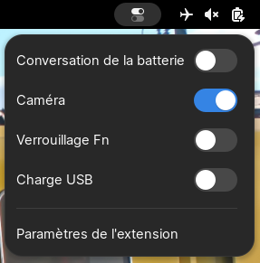

# IdeaPad Controls

GNOME Shell extension for controling Lenovo IdeaPad laptops options.

**Available options:** Conservation Mode, Camera Lock, Fn Lock, Touchpad Lock, USB charging.




# Installation

Make sure the `gettext` package is installed, or install it with your package manager.

## GNOME Extensions
Install from [GNOME Extensions](https://extensions.gnome.org/extension/8007/ideapad-controls/).

## Manual

First, install `make` using your package manager.

Clone the repo, then execute `make install` inside repo's directory.


# Password-less setup

By default, root permissions are needed to write sysfs nodes used to control ideapad laptop parameters, but this extensions calls `pkexec` which asks for your password everytime to write those files. If you want to make it work without a password, you can follow these instructions.

First, create a group named `ideapad_laptop` and add yourself into that group:
```bash
groupadd ideapad_laptop
usermod -aG ideapad_laptop $USER
```

Then download the `99-ideapad.conf` file from this repository and place it into `/etc/tmpfiles.d` (requires root privileges).

You can also do it by using `sudo curl -o /etc/tmpfiles.d/99-ideapad.conf https://raw.githubusercontent.com/Woomymy/ideapad-controls-gnome-extension/refs/heads/master/99-ideapad.conf`

If you have a local copy of the repository, you can also run `make tmpfiles-install` in the root of the repo.

